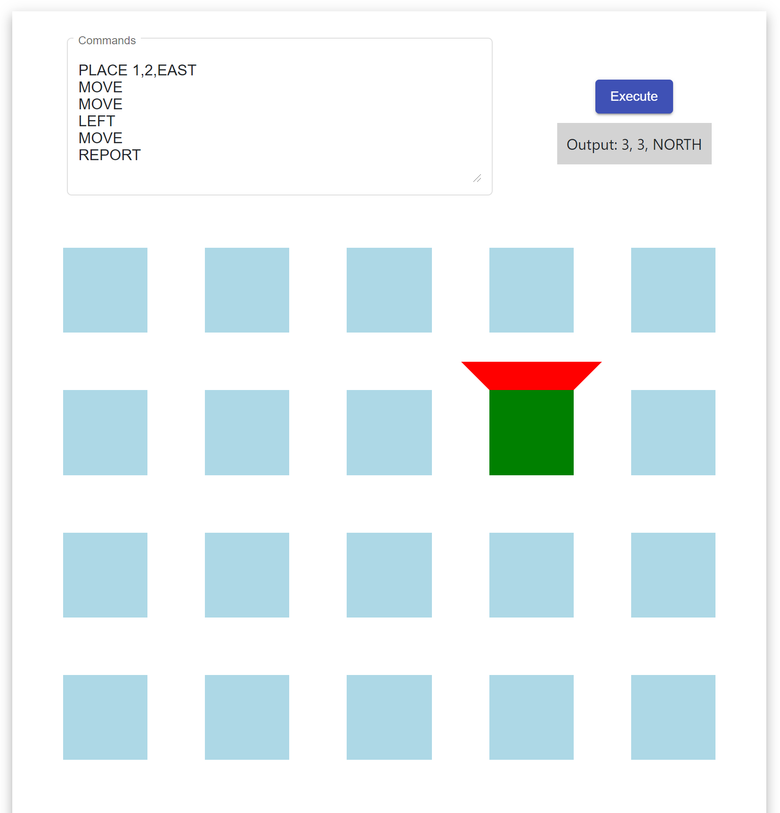

# ToyRobot by GregLuo(0406518207)

Implemented with Angular 12 and Material Design

## Play it directly

Open the URL  `https://toplearning.com.au/robot` to play the game. (I know this is unnecessary, and I did it just for fun).

## Run the simulator

Run `yarn`, then `ng serve` for a dev server. Navigate to `http://localhost:4200/`.

## Running unit tests

Run `ng test` to execute the unit tests.
Please find the unit test cases at "robot.service.spec.ts" because I implemented all the business logic in "robot.service.ts".

